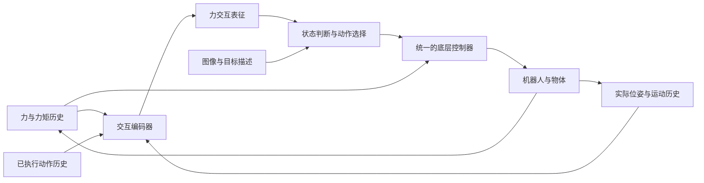

# Force Representation Lab

面向接触操作的力表征研究：从积木装配到位判断与失败恢复开始。

**状态：实验设计草案，尚无采集数据、训练结果或可执行机器人程序。** 创建于 2026-10-01。本文的架构、样本量和日程均为建议方案；设备相关参数需要实测后冻结。

## 研究问题

能否将力与力矩的时间序列，结合机器人实际运动及已执行动作，编码为可迁移的交互表征，使模型更可靠地判断“正在插入、已装好、卡住了”，并选择继续、停止或恢复？

主线是 **原始力信号 → 动作条件下的交互表征 → 状态与结果判断 → 闭环动作**。先用小模型检验表征，再研究接入 VLM/VLA；避免把完整大模型训练作为第一步。

## 从现有积木开始

目前确认已购买的是照片中的 **1000PCS Building Blocks 兼容式凸点积木**。照片不能确认品牌、精确尺寸、材料或配合力；下文的 2×4、2×2 均指凸点排列，需核对实物。

第一套装置：固定下方 2×2 积木，机器人预先夹持或通过适配器固定上方 2×4 积木，完成指定位置的压装。比较对齐、轻微横向偏移和轻微倾斜三种起始条件。后续演示可扩展为“补齐彩色低矮积木墙”。

**成功必须同时满足目标格位正确和完全就位。** 力变大不能单独证明成功；装错一格也可能牢固咬合。夹爪、六维力传感器、相机和机器人型号尚未确认。

## 文档导航

| 文档 | 用途 |
| --- | --- |
| [研究想法](docs/research-idea.md) | 表征定义、假设、方法与创新边界 |
| [实验计划](docs/experiment-plan.md) | 分阶段路线、基线、数据量、评估与停止条件 |
| [积木实验操作规程](docs/brick-assembly-protocol.md) | 夹具、标定、单次实验、恢复和真值判定 |
| [数据与标注规范](docs/data-spec.md) | 同步、坐标系、数据切分与防止标签泄漏 |
| [相关工作](docs/related-work.md) | 与已有力感知操作、VLA 和积木研究的关系 |
| [待确认设备与决策](docs/setup-and-decisions.md) | 开始采集前需要填写的信息 |
| [实验配置模板](configs/experiment.example.json) | 待标定参数；不可直接驱动机器人 |
| [单次实验记录模板](templates/episode-manifest.example.json) | 元数据、独立真值与数据路径 |
| [结果表模板](templates/results.csv) | 空表；不包含虚构实验结果 |

## 系统草图

图中的底层力反馈与限幅机制对所有方法保持一致，包括不接收力输入的高层模型。语义模型不承担实时保护。

## 近期工作

1. 填写设备信息，挑选并编号积木，制作刚性固定夹具。
2. 完成力传感器、工具、时钟与装配高度标定。
3. 用 5 对积木做 60 次先导实验，检查可重复性和标注质量。
4. 先比较规则法、无高层力输入模型、直接使用力历史的模型与所提表征。
5. 达到阶段门槛后再扩大数据、接入 VLM/VLA、增加按压或擦拭任务。

[ForceVLA](https://sites.google.com/view/forcevla2025) 和 [FM-VLA](https://arxiv.org/abs/2607.18231) 已探索力与 VLA 的融合及力历史编码。因此，本项目把“可验证的表征收益与跨条件迁移”作为待检验问题，不将“把力接入 VLM”本身视为已成立的创新。

## 仓库范围

当前只存放研究文档和模板。原始录像、传感器数据、模型权重保存在独立数据目录并记录校验和；默认不提交 Git。未选择开源许可证，后续公开前再确定代码、数据与文档的许可。
